<h1 align="center">My Unsplash Frontend</h1>

<div align="center">
   Solution for a challenge from  <a href="https://web.archive.org/web/20231130035602/https://legacy.devchallenges.io/challenges/rYyhwJAxMfES5jNQ9YsP" target="_blank">Devchallenges.io</a>.
</div>

## Table of Contents

- [Overview](#overview)
  - [Built With](#built-with)
- [Features](#features)
- [How to use](#how-to-use)
- [Thoughts](#thoughts)
- [Useful Resources](#useful-resources)

## Overview

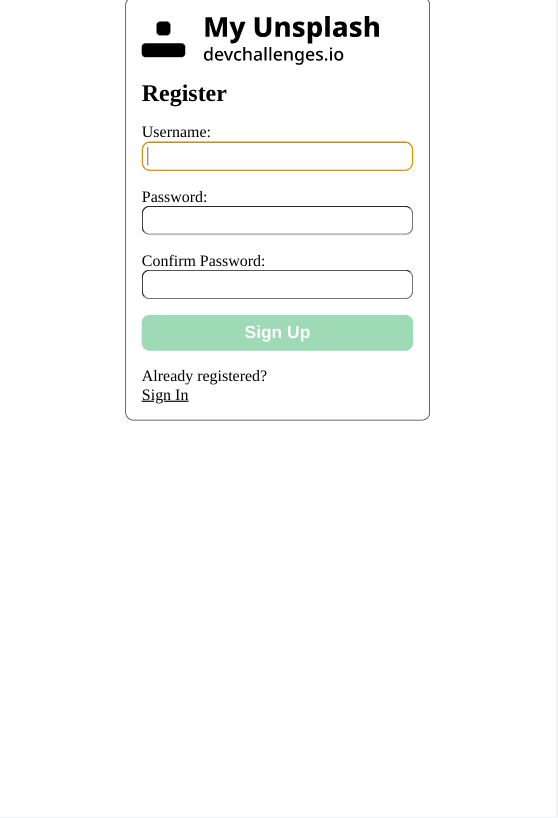

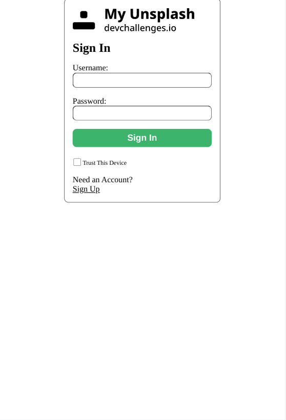

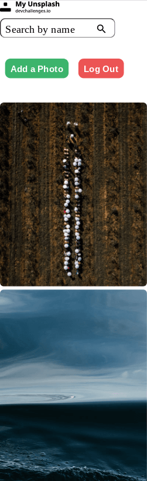


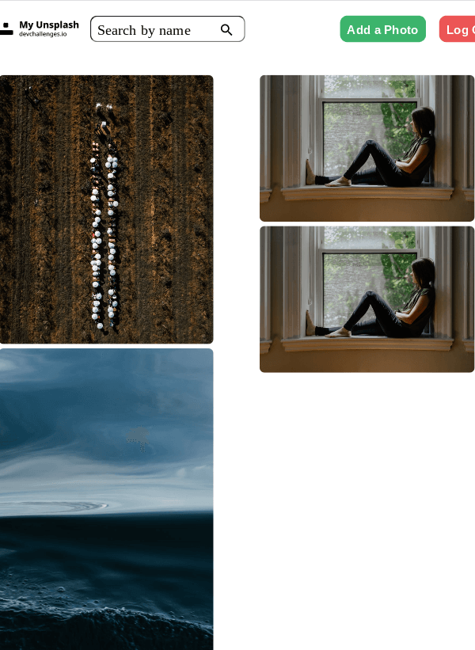

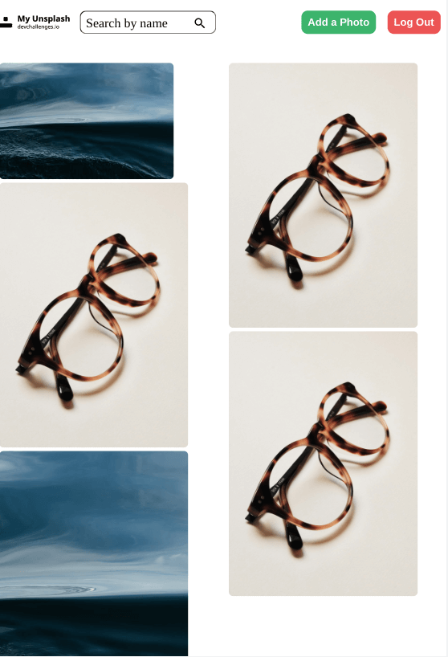

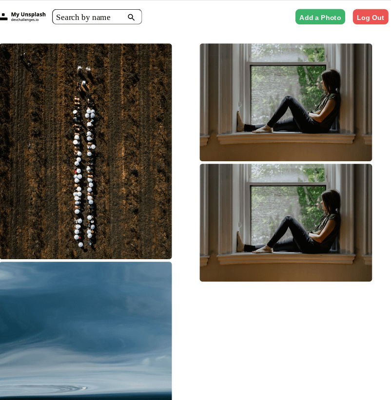

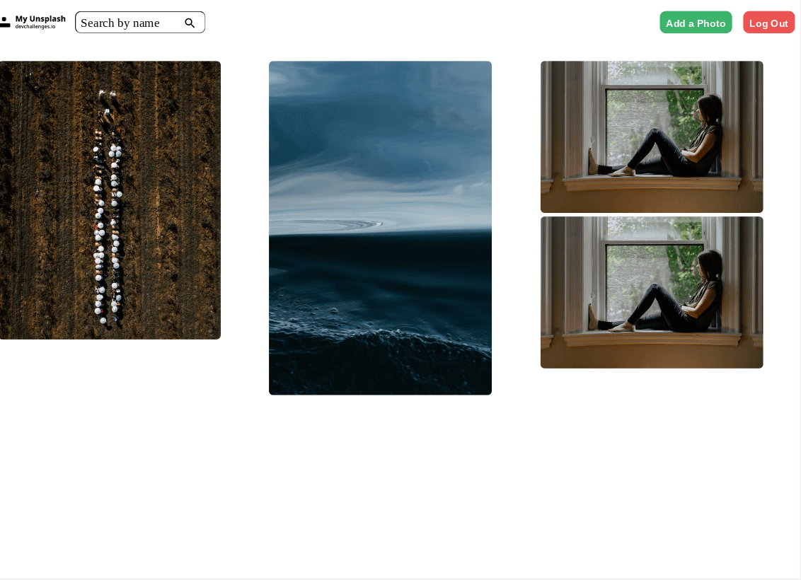

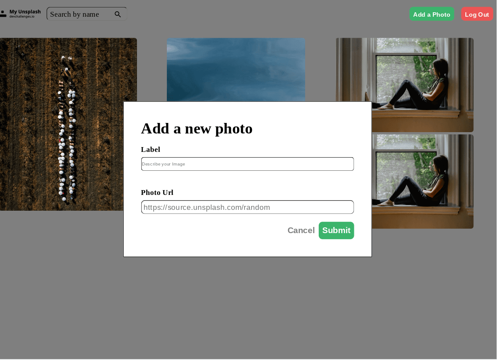

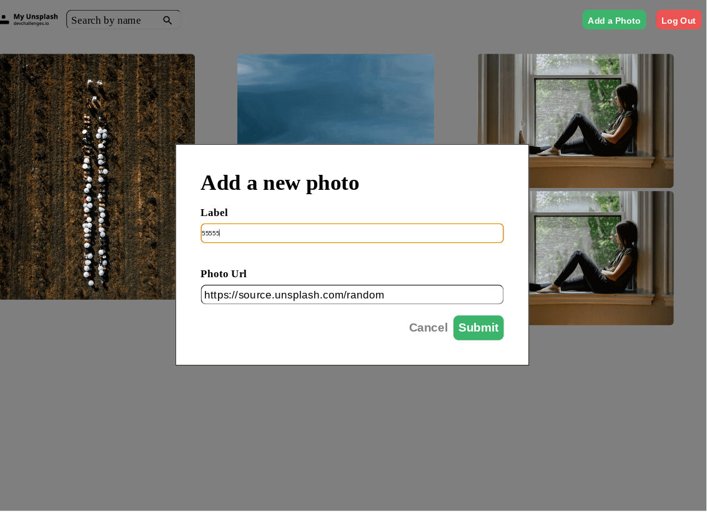

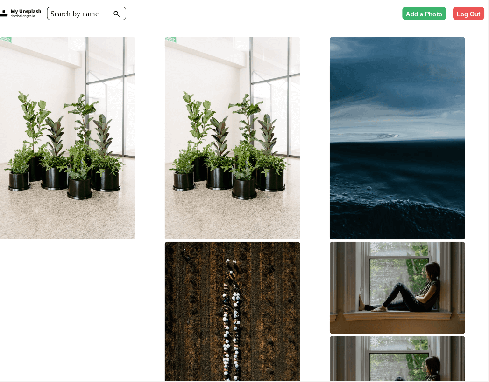

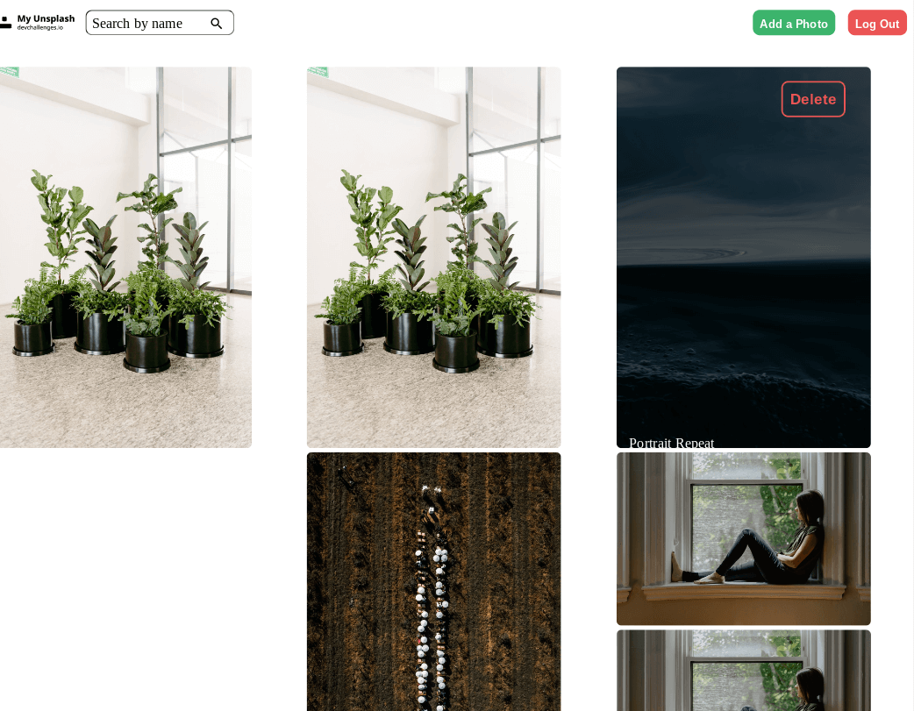

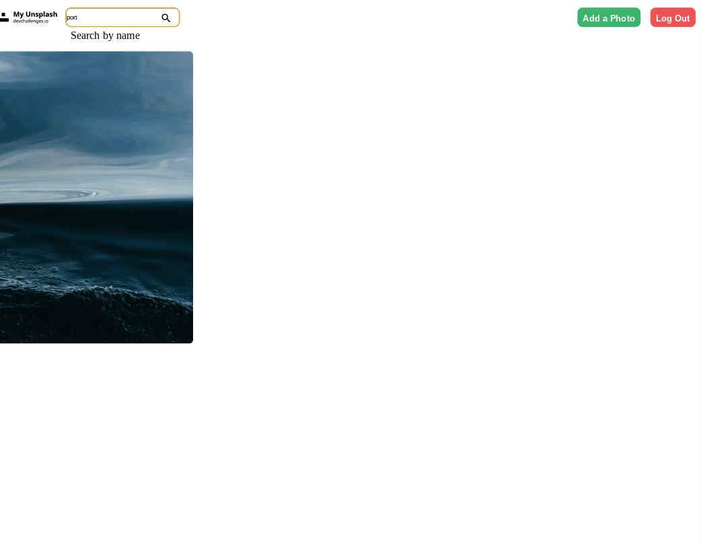

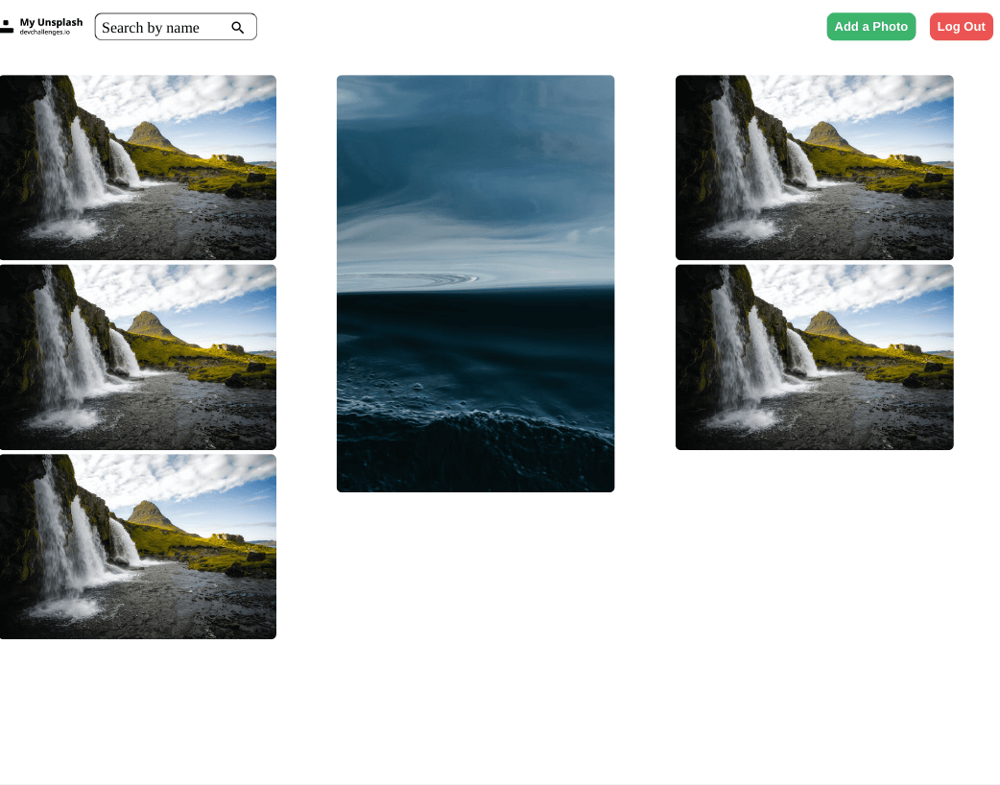

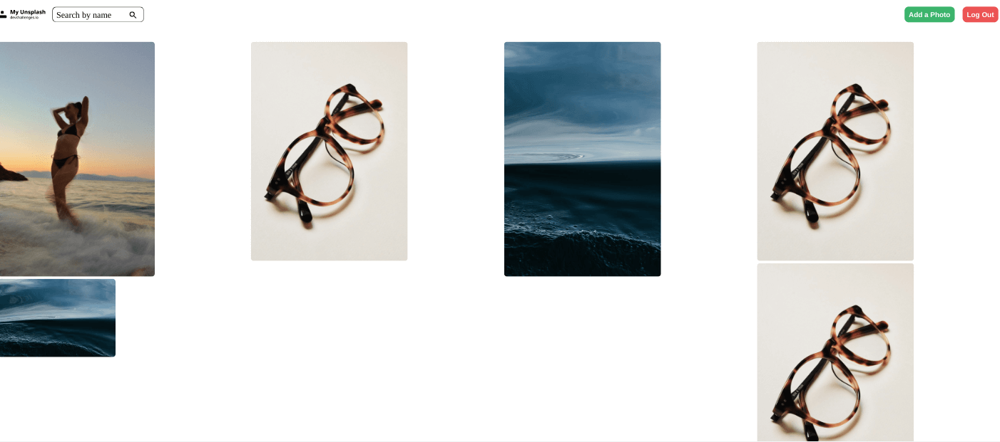

### Built With

- [React](https://reactjs.org)
- [Axios](https://axios-http.com)

## Features

This application/site was created as a submission to a [DevChallenges](https://devchallenges.io/challenges) challenge. The [challenge](https://web.archive.org/web/20231130035602/https://legacy.devchallenges.io/challenges/rYyhwJAxMfES5jNQ9YsP) was to build an application to complete the given user stories. **Note**: The previous design document may be incomplete, as you need to find an archived version of the challenge as all `legacy` challenges have had their documentation removed from DevChallenges.

## How To Use

To clone and run this application, you'll need [Git](https://git-scm.com) and [Node.js](https://nodejs.org/en/download/) (which comes with [npm](http://npmjs.com)) installed on your computer. From your command line:

```bash
# Clone this repository & the backend repo (need to add env variables to backend)
$ git clone https://github.com/jdegand/my-unsplash-backend.git
$ git clone https://github.com/jdegand/my-unsplash-frontend.git

# Install dependencies in both repos
$ npm install

# Run the both apps (in frontend - enable cookies)
$ npm start
```

## Thoughts

- JWT Cookie needs to use 'secure:true' or chrome will block the cookie.
- Windbnb, Cat Wiki, Mongo Async Crud, React Register Tut used to create this.  
- Images are not capped by height.  So they can be larger and smaller.  Used columns to approximate the masonry look.  
- Using grid - grid-auto-flow: dense - really doesn't help create a masonry like look.  Experimental 'masonry auto flow' has no support and may not be adopted at all.  
- Using columns seems to be a good way of achieving a similar look without using external libraries.  
- Testing is difficult using random images because they will change after a few minutes of time.  I could use cloudinary and add different sized pictures and then have a url to get the images.  
- On hover, the delete button is positioned right 10% so if picture is not wide enough the button may not overlap the image.      
- Used a url regex to valid the input - this could probably be improved or looked into more.  
- The search filter has an useless submit function - I could remove the button and just add the magnify svg as a background image.  
- I prefer the search filter to automatically filter results versus waiting to the submit button to be clicked.
- Could have added the authentication header to axiosPrivate instance
- Used a chained ternary in the Images component render 
- Could have used a state object for the username and password and one onChange handler vs separate state and onChange handlers
- Added all styles to index.css versus multiple style sheets for various components.
- Add a package to disable react dev tools - to prevent accessToken tampering.
- Used `response.data['accessToken']` - response.data.accessToken didn't work  
- Used state to prevent a ton of requests to the backend - adding images to the first useEffect in Images - caused a ton of requests to the backend - probably could refactor that useEffect and maybe not even need my workaround. 
- Need to look more into Axios. Axios has advanced features that I have not used frequently.  
- Removed JWT-decode - not really necessary 
- All pictures are linked to a user 
- Could create a page where all user pictures are displayed and you can only delete when logged in etc
- Adding authentication made sense over using a password delete system - which I have done similarly in [odin-project-members-only](https://github.com/jdegand/odin-project-members-only)
- Lazy loading - problem might be not knowing the dimensions of random image

## Useful Resources

- [Medium](https://levelup.gitconnected.com/react-template-for-jwt-authentication-with-private-routes-and-redirects-f77c488bfb85) - jwt authentication and private routes / redirects
- [Awik](https://awik.io/generate-random-images-unsplash-without-using-api/) - generate random images from unsplash without api key
- [Stack Overflow](https://stackoverflow.com/questions/10123953/how-to-sort-an-object-array-by-date-property) - sort an object array by date
- [Stack Overflow](https://stackoverflow.com/questions/3809401/what-is-a-good-regular-expression-to-match-a-url) - regex to match a url
- [Medium](https://javascript.plainenglish.io/build-a-pinterest-layout-in-reactjs-458b815126d8) - pinterest layout in react
- [Blog](https://tutorial101.blogspot.com/2021/10/reactjs-image-gallery-react-masonry.html) - react image gallery react masonry
- [Medium](https://medium.com/suyeonme/react-how-to-prevent-unnecessary-api-calls-649b6a6ab84d) - prevent unnecessary api calls
- [Stack Overflow](https://stackoverflow.com/questions/55439651/react-hooks-props-in-useeffect) - props & useEffect
- [Stack Overflow](https://stackoverflow.com/questions/52184975/how-to-prevent-cascading-filters-or-undo-cascaded-filter) - prevent filter cascade
- [Mastering JS](https://masteringjs.io/tutorials/axios/delete) - axios delete
- [Stack Overflow](https://stackoverflow.com/questions/51069552/axios-delete-request-with-body-and-headers) - axios delete request 
- [MDN Docs](https://developer.mozilla.org/en-US/docs/Web/CSS/masonry-auto-flow#browser_compatibility) - masonry auto flow
- [FreeCodeCamp](https://www.freecodecamp.org/news/build-an-image-gallery-with-nextjs/#how-to-fetch-data-from-the-pexels-api) - image gallery with pexels api
- [YouTube](https://www.youtube.com/watch?v=-isQPqqnIBo) - CSS Masonry Layout with columns
